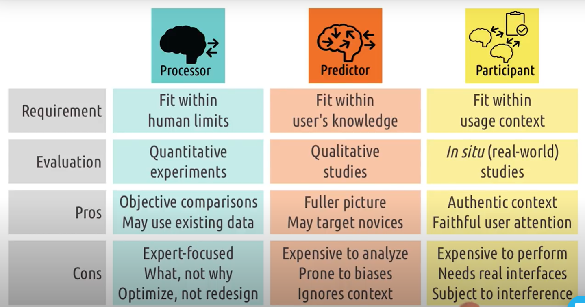

# Lesson 4

In this lesson we will cover: Fundamental building blocks and foundational elements

1. Focusing on the task
2. Role of the interface in mediating users and tasks
3. The role of the user: Processor? Predictor? Participant?
4. User experience at multiple levels

## Users and Tasks
1. Users use interace to do a task
2. Focus on user and task through interface 

## Identifying A Task
 
How do should we go about identifying a task?

1. Watch real users - get people and ask them to work with you
2. Talk to them - talkthrough the user 
3. Start small - find small task which user performs
4. Abstract up - keep asking why till you reach beyond scope of design (small + small + big - series of why)
5. You are not your user

Usually these comes in HCI methods

## Usefulness And Usability

Remember that one of the goals of HCI is to not only make a product that is useful but also useable. 

Map vs GPS navigation. Manual writing of terms. Gmaps

- **Cognitive load** - the total mental effort being used in working memory.  GMaps reduces cognitive load.

## HCI principles

Reflection on reasoning top down vs bottom up

## Views Of The User

There are three different roles a human can play:

1. **Processor**:

   - Sensory processor that takes input in give output.
   - Stems from Behaviorism (observable behaviors and outcomes) 
   - Usability - Phyical usability 
   - Design focus is that Interface must fit within human limits
   - Evaluated by quantitative experiments

2. **Predictor**:

   - Humans knowledge experience expectation and thought process
   - Stems from Cognitivism (what goes on in the users mind?)
   - Interface must be based on knowledhe and leverage what they know - fit with knowledge
   - Evaluated by qualitative studies (exitu studies)
   - 1 user - 1 task

3. **Participant**:

   - Participant in environment. 
   - Implcit knowledge and other factors due to environment.
   - Whats available cognitive resources and whats competing for attention
   - Interface must fit with the context
   - Evaluated by _in situ_ studies
   - Stems from Functionalism (user and the interface are participants in an environment)

- **Ex situ** - in a controlled or otherwise inauthentic environment
- **In situ** - within the authentic context

## Designing with 3 views

Tesla model S - Text box, results, keyboard and map

Processor
---------
	- control study
	- interfaces and get the timing
	- Pros
		- Use existing data.
		- Objective comparison (text v/s voice).
	- Reason is not visible
		- why text is not better than voice.
		- Novice confusing.
	- Suitable for only evaluation and optimization, not redesign.

Predictor
----------
	- Ask interviews and focus groups
	- Get full details on textual description
	- Why use different interfaces at different time
	- why choice, why paritcular option
	Pros
		- More complete picture of interaction
		- Caters for experts and novices
	Cons
		- Analysis is costly
		- Bias in analysis. Focus on specific set of data points.
		- Ignore broader context. 
		- Ex Only person and interface. Example maps in driving vs map in labs. *5 sec disappearence of search bar

Participant
-----------
	- Consider broader activity
	Pros
		- Evaluates interaction in context
		- Capture authentic user attentions
	Cons
		- Expensive analysis to perform and analyze both
		- Requires real functional interfaces, no prototypes
		- Hard to use when starting fresh
		- Lots of uncontrollable variables

	Each design informs one another	

## God vs bad design
- Processor - Instantaneous.
- Predictor - They may need couple of mins.
- Particpant - Kid on back.

## User experience, sans design
- There is always user experience
- UX design focuses on dictating users experience
- It comes due to humans and tasks
- Scope of user experience
	- Individual - Feels of design like vs deslike
	- Workgroup - FB keeps ppl in touch
	- Societal - Twitter, FB relationship status

## Important videos
2,4,7,8,9,10 and Practise Quizes for revision
