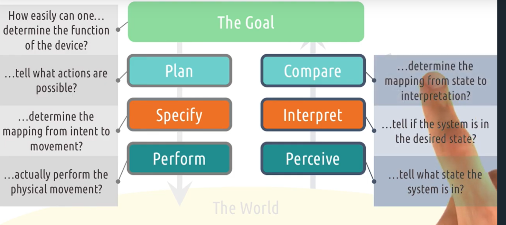
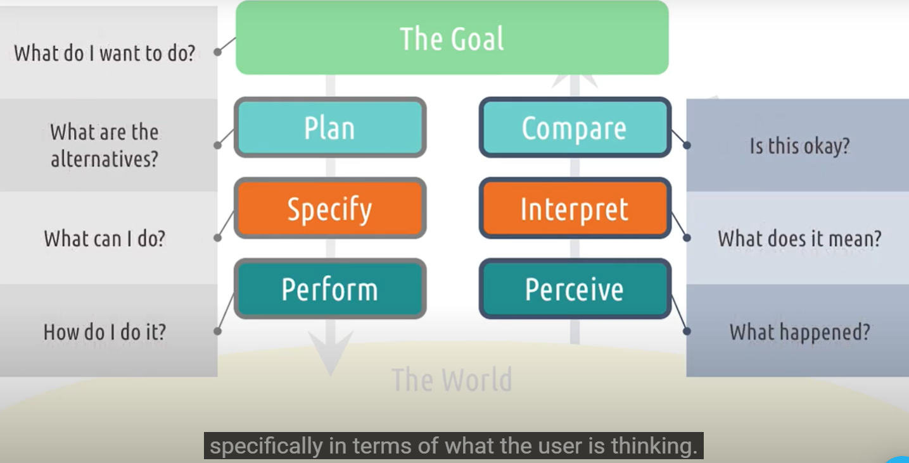
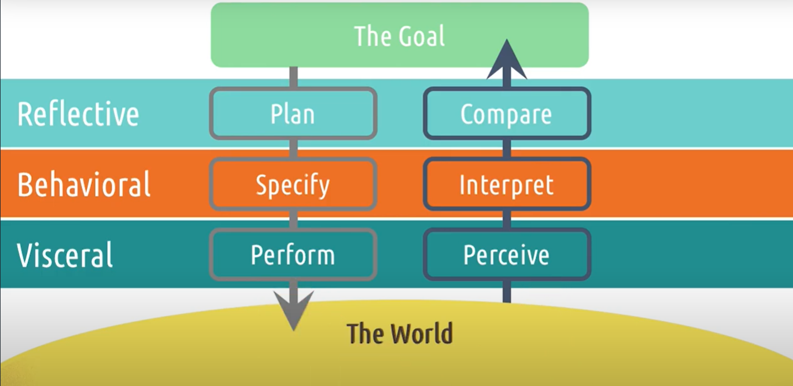

# Lesson 5

Feedback cyle - exchange of input and output to achieve a goal

We cover feedback cycles in this lesson. In addition we will cover:

- **Gulf of execution** - distance between a user's goals and the actions required to realize those goals
- **Gulf of evaluation** - distance between the effects of those actions and the user's understanding of the results

## Gulf Of Execution

- How do I know what I can do
- I know goal, how to make it reality. State -> goal state
- How hard is to do what is necesaary to get to goals
- How do they figure out what to do to go to goal state.

There are a number of components in the gulf of execution:

Goal is cook - intent is microwave for 1 min.
1. Identify intentions - goals in context of system. Mismatch on goals is possible.
2. Identify actions - What action is needed to make goal reality in current system.
3. Execute in interface - Goal and action are known, they should be able to execute action in interface. Button presses.

How do we go about bridging the gap between user's goals and actual execution?

Tips:
1. Make functions discoverable
2. Let the user mess around
3. Be consistent with other tools - Ctrl c for copy
4. Know your user - command line vs UI
5. Feed-forward - Feedforward (give what will happen if you keep doing same thing)

## Gulf Of Evaluation

There are a number of components in the gulf of evaluation:

- user need to evaluate new state due to action

1. Interface output - What did it do upon action.
2. Interpretation - Can user interpret meaning of output?
3. Evaluation - Evaluate the interpretation to check if goals was realized or not.

How do we go about bridging the gap between the effects of user's actions and actual results?

Tips:

1. Give feedback constantly at every step on process
2. Give feedback immediately
3. Match the feedback to the action
4. Vary your feedback
5. Leverage direct manipulation

## Don Normans design
7 "how easily" Questions

## Important Videos
Videos 3 to 9
Gulf of execution and evaluation
Normans cycles and 7 Questions
See examples from david at end

<!-- ## Section Quizzes

### Reflections: Feedback Cycles

_What was a time you were interacting with an interface but couldn't think of how to accomplish what you wanted to accomplish? What about when you couldn't tell if you had accomplished want you wanted to accomplish?_

- Gulf of execution: there is a microwave in my office and it does not have any standard controls as what you would find at home, there are several steps one must follow in order to set the time and heat your food and it usually takes several of tries to get right
- Gulf of evaluation: when I was driving an older model of the Toyota Prius, the engine sleep/shut-off (mainly at stops) would cause the car to sort of stall in a way that was very inconvenient because it was difficult to get feedback from the car for a brief moment so I would always been unsure if my pedal would register and get the car to move

### Feedback Cycles In David's Car 1

_Why is the start button located here?_ It is where the user expects the button to be.

### Feedback Cycles In David's Car 2

_Is the car on?_ No

### Feedback Cycles In David's Car 3

_What are some ways this feedback cycle could be improved?_

I was a bit confused when the car was not turned on, I normally listen to the car engine to see if the car was turned on but it almost seemed like the button had a different function at first. I would change that sound and also alert the driver that the car is not on.

### Design Challenge: Credit Card Readers 1

_What are some ways that inserting the card gives a better feedback cycle than sliding it?_

For one, the action of just inserting the card becomes binary (you either insert or don't) instead of creating a requirement on the customer to figure out how to swipe a card. Users can actually see that the card is inserted and feel that something is being done while their card is inserted.

### Design Challenge: Credit Card Readers 2

_How can we build feedback into this system to prevent customers from walking away without their credit cards?_

Two ideas come to mind:

- Make a sensor that detects when a customer is too far away from the card reader and sound an alert when the customer walks away and the card is still inserted
- Automatically eject the card after the payment is done and make an alert when the transactions is completed (I've seen this done at grocery stores like Costco or Wegmans)

### Design Challenge: Credit Card Readers 3

_What's wrong with asking how to make the process of sliding a credit card easier?_ It forces us to think only in terms of the credit card itself
 -->